# 🔄 Customer Churn Prediction — From Scratch

A machine learning project that predicts employee attrition using **four classifiers built entirely from scratch** in NumPy — no scikit-learn models, just raw math. Includes SHAP and LIME explainability analysis.


[](LICENSE)

---

## 📌 Overview

This project trains and evaluates four ML models on the IBM HR Analytics Attrition Dataset to predict whether an employee will leave the company.

**Every model is implemented from scratch using NumPy** — no `sklearn.ensemble`, no `sklearn.svm`.

| Model | Key Idea |
|---|---|
| **Random Forest** | Bootstrap sampling + majority vote across decision trees |
| **Extra Trees** | Random thresholds (no grid search) + full dataset per tree |
| **Gradient Boosting** | Sequential trees fitting log-loss residuals |
| **SVM** | Hinge-loss gradient descent, margin maximization |

---

## 📁 Project Structure

```
Customer Churn Prediction/
│
├── data/
│   └── attrition.csv            # IBM HR dataset (included)
│
├── models/
│   ├── decision_tree.py         # Base decision tree (Gini impurity)
│   ├── random_forest.py         # Random Forest ensemble
│   ├── extra_trees.py           # Extremely Randomized Trees
│   ├── gradient_boosting.py     # Gradient Boosting (log-loss)
│   └── svm.py                   # Linear SVM (hinge loss + SGD)
│
├── utils/
│   ├── preprocessing.py         # Data loading, SMOTE, scaling
│   └── metrics.py               # Evaluation, confusion matrix, comparison plots
│
├── explainability/
│   ├── shap_analysis.py         # SHAP KernelExplainer for all models
│   └── lime_analysis.py         # LIME local explanations
│
├── outputs/                     # Auto-created at runtime — plots saved here
│
├── main.py                      # Entry point — runs everything end to end
└── requirements.txt
```

---

## ⚙️ Setup

```bash
# 1. Clone the repo
git clone https://github.com/Naruto109k/Customer-Churn-Prediction.git
cd Customer-Churn-Prediction

# 2. Create a virtual environment (recommended)
python -m venv venv
source venv/bin/activate      # Windows: venv\Scripts\activate

# 3. Install dependencies
pip install -r requirements.txt
```

> The dataset is included in `data/attrition.csv` — no extra download needed.

---

## 🚀 Usage

```bash
python main.py
```

This will:
1. Load and preprocess the dataset (label encoding + SMOTE balancing)
2. Train all four models and print metrics
3. Save confusion matrices and comparison plots to `outputs/`
4. Run SHAP (global feature importance) for all models
5. Run LIME (local explanation for employee #0) for all models

> ⚠️ SHAP with `KernelExplainer` is slow — expect **10–15 minutes** for all models.

---

## 📊 Results

| Model | Accuracy | F1 Score | AUC-ROC | Train Time |
|---|---|---|---|---|
| **Random Forest** ⭐ | **88.46%** | **0.886** | **0.953** | 24.76s |
| Extra Trees | 87.04% | 0.870 | 0.948 | 3.70s |
| SVM | 81.78% | 0.816 | 0.890 | 12.17s |
| Gradient Boosting | 79.96% | 0.799 | 0.880 | 42.19s |

**Random Forest** achieved the highest accuracy and AUC-ROC. **Extra Trees** is the efficiency standout — nearly identical performance in just 3.7s vs 24.8s, by skipping exhaustive threshold search entirely.

### Confusion Matrices
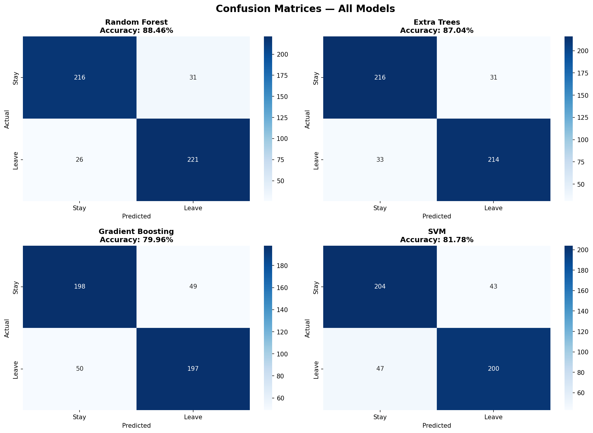

### Model Performance Comparison
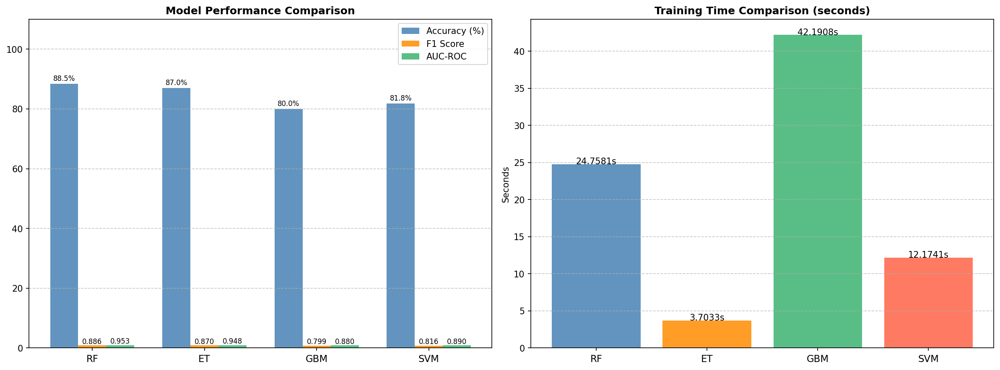

---

## 🔍 Explainability

### SHAP — Global Feature Importance

SHAP uses `KernelExplainer` (model-agnostic) to measure how much each feature shifts the prediction on average across the test set.

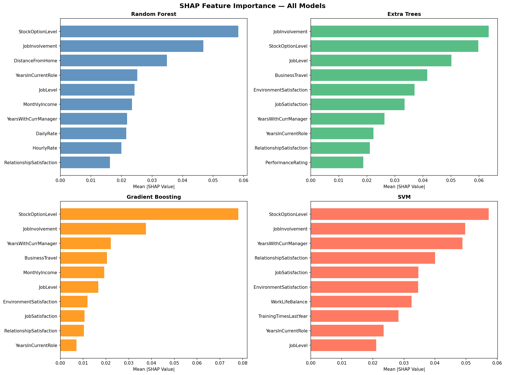

**Key finding:** `StockOptionLevel` and `JobInvolvement` rank in the top 2 across **all four models** — a strong cross-model signal that these features genuinely drive attrition.

<details>
<summary>📈 View individual SHAP beeswarm plots</summary>

| Random Forest | Extra Trees |
|---|---|
| 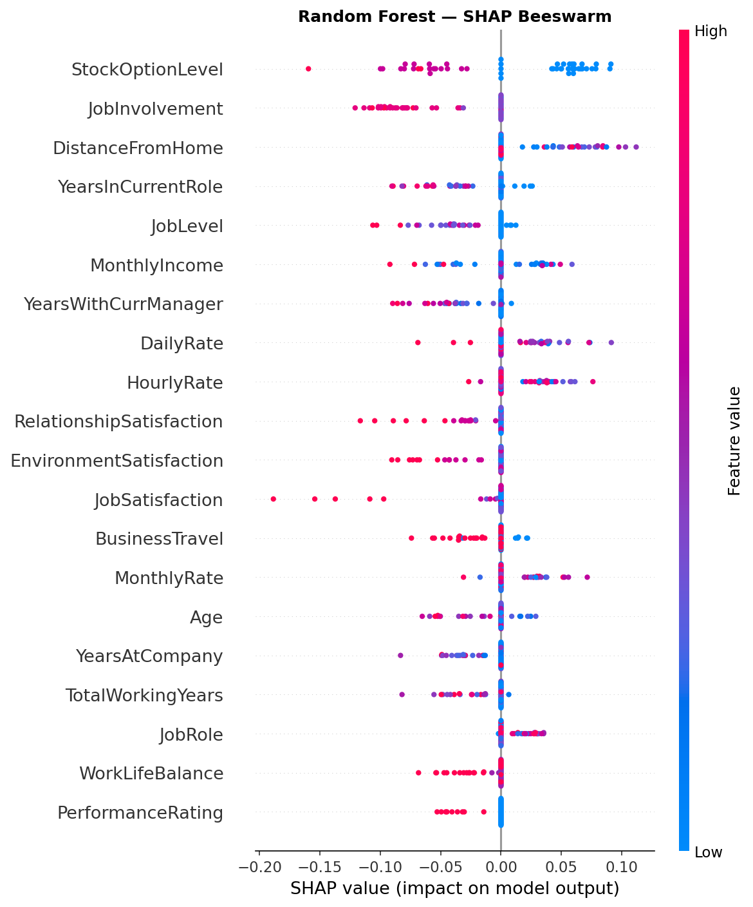 | 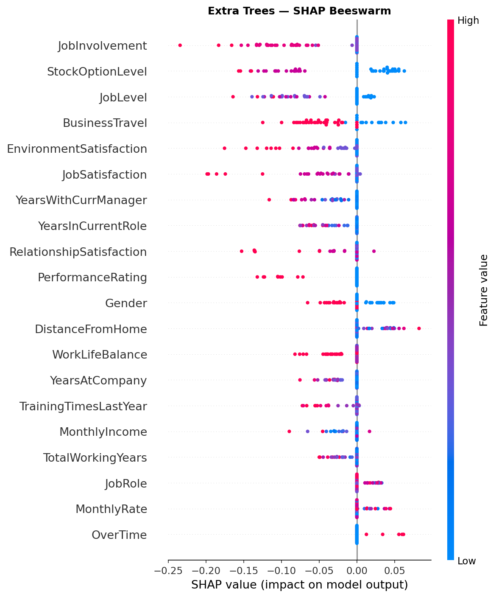 |

| Gradient Boosting | SVM |
|---|---|
| 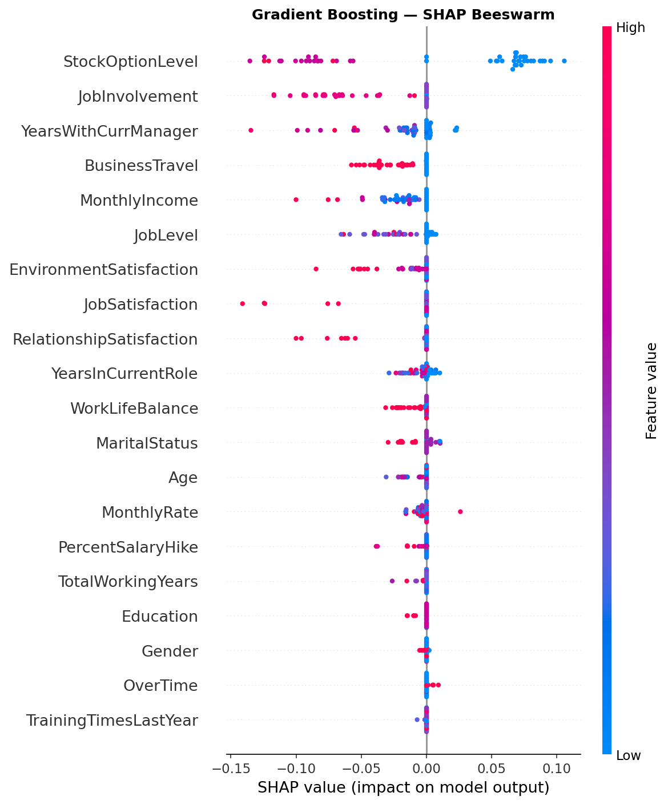 | 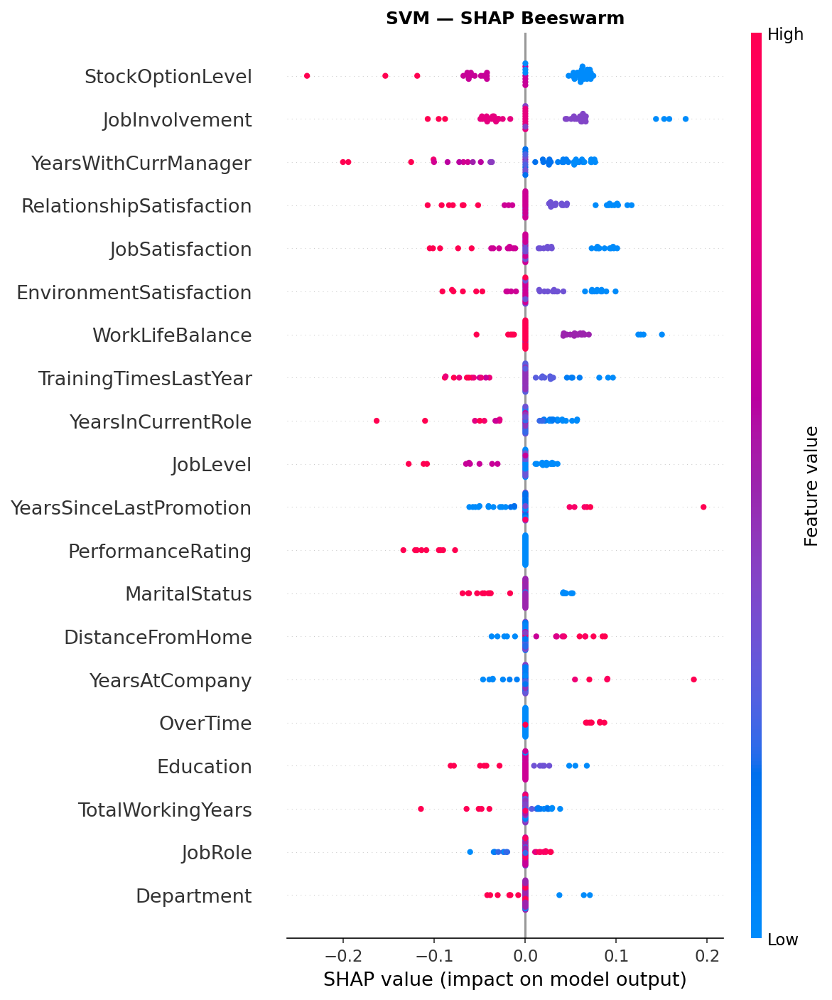 |

</details>

---

### LIME — Local Explanation (Employee #0)

LIME explains a single employee's prediction by fitting a linear model in the neighbourhood of that instance. Green bars push toward **Stay**, red bars push toward **Leave**.

| Random Forest | Extra Trees |
|---|---|
| 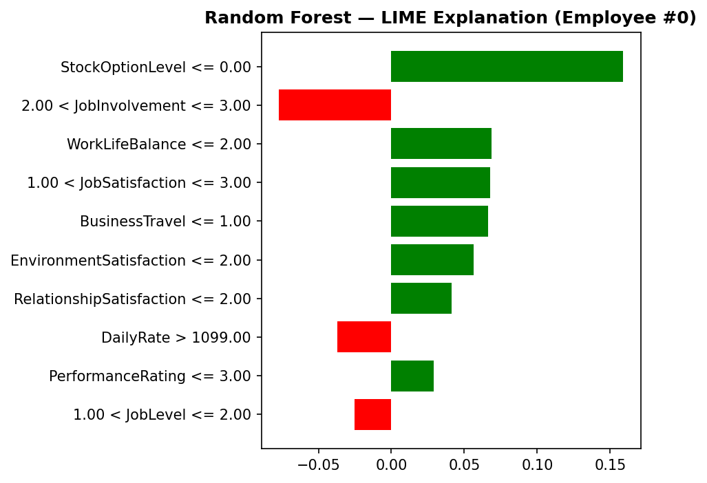 | 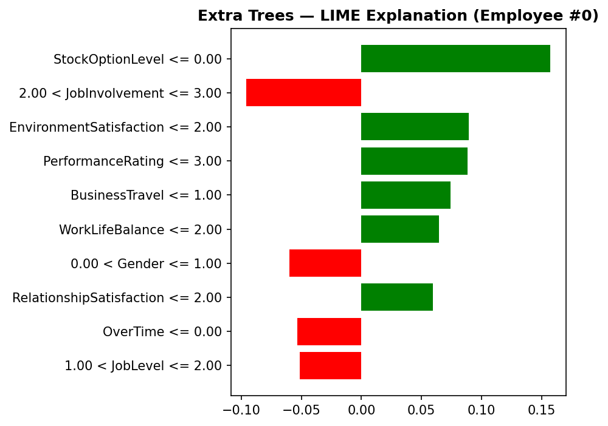 |

| Gradient Boosting | SVM |
|---|---|
| 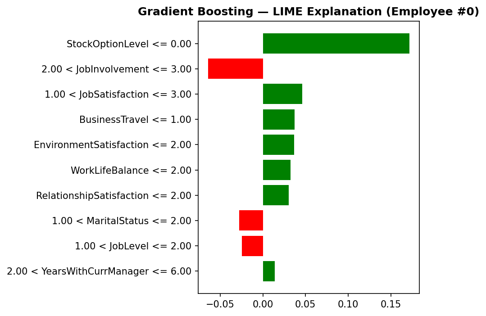 | 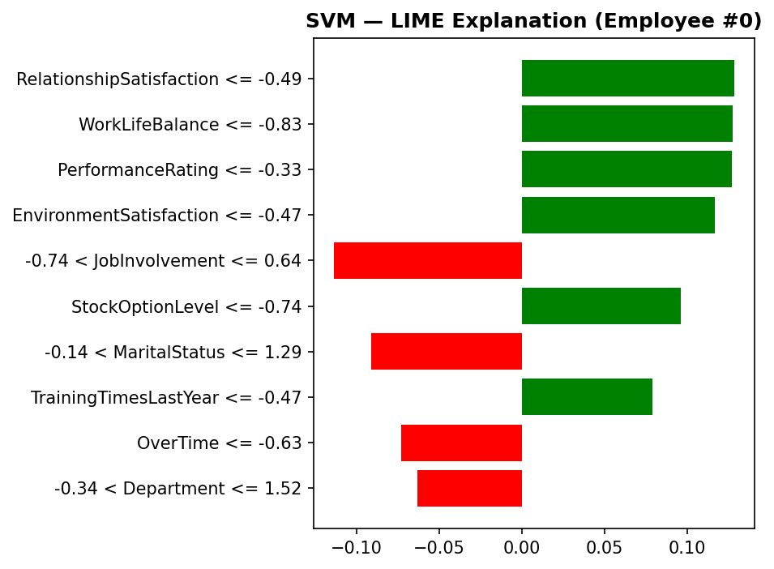 |

**Key finding:** All four models agree on Employee #0 — `StockOptionLevel` is the dominant feature, and high `JobInvolvement` consistently reduces predicted churn risk.

---

## 🧠 Key Design Decisions

- **SMOTE** balances the heavily skewed dataset (~84% Stay / ~16% Leave) before splitting
- Tree models train on **raw features**; SVM trains on **standardized** features — both splits use the same `random_state=42` so test rows are identical across models
- `predict_proba` on SVM uses a sigmoid approximation over the raw margin scores
- Extra Trees uses **no bootstrap sampling** and **random thresholds** — this is what makes it so fast while staying competitive

---

## 📦 Requirements

```
numpy
pandas
scikit-learn
imbalanced-learn
matplotlib
seaborn
shap
lime
```

---

## 📄 License

This project is licensed under the MIT License — see the [LICENSE](LICENSE) file for details.
